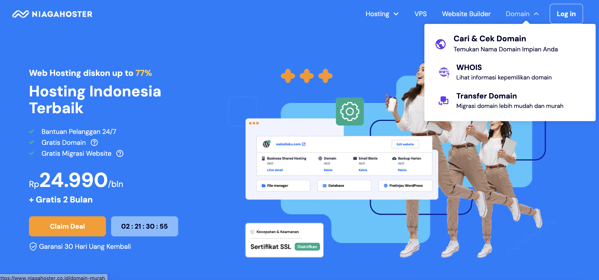
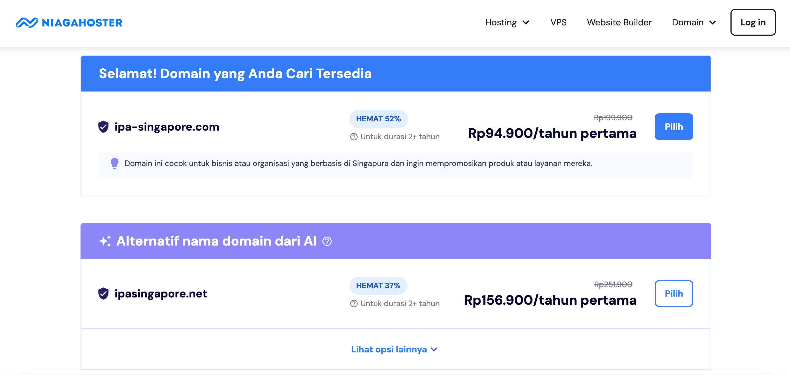

Hi, my name is Yosephine Gita Asaria Hutauruk

# Gita's Profile
Tech sales professional currently working as Account Executive at MongoDB.

## Connect with me
|Socials   |Link   |
|-------|------------|
|LinkedIn   |[Gita Asaria](https://sg.linkedin.com/in/gita-asaria)     | 
|Whatsapp  |+65 83198749     | 
|Instagram   |@yosegita     | 

## What I'm Building
I'm building a simple HTML site for Indonesian Professionals Association in Singapore. In this page, members can sign up and view upcoming events, as well as registering for them directly. You can visit my link [here](http://ipa-singapore.com).

## How did I deploy my IPA Singapore Website?
1. First of all, I created a Netlify account. In this screenshot, my Netflify account is already created.

2. Second of all, I connected by Netlify account to my Github account

3. Third of all, I selected the repository I intended to deploy

4. Fourth of all, Netlify will show all available repositories from Github, and I selected revou-fsse-5. I clicked configure.

5. Next step, select the type of Repository access Netlify would have. This time, I selected 'Only select repositories'. As I am taking the screenshots after completing the steps, you can see that my repository revou-fsse-5/module-2-yosegit111 was already selected.

6. After that, Netlify will bring you to a site setup page, where you can check the availability of your domain. However-once again, as I'm taking screenshots after this step was done, you can change your sitename accordingly but going to Settings -> General Site Settings -> Change Site Name.

7. Once I deployed on Netlify, I purchased a domain on Niagahoster 

8. I input my desired domain, which in this case is ipa-singapore.com

9. Next, I clicked 'Cek Sekarang' and chose the desired domain

10. After that, I chose the subscription plan and completed payment

11. After completing payment, I can see on my Niagahoster account that I own the domain ipa-singapore.com. To connect this with our deployed page on Netlify, navitage back to Netlify and chose 'Domain Management' and click 'Add domain sites'

12. Input the domain ipa-singapore.com and navigate back to Domain settings page.

13. Here, scroll down to Name Servers. 

14. Navigate back to Niagahoster -> Domain -> click 'Ganti nameserver'. Copy and paste all of the corresponding name servers to the empty four fields.

15. Finally, the page is live on the purchased domain!

Thank you!